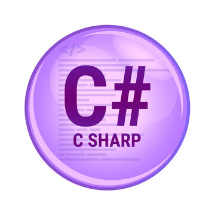

# Репозиторий "C_learn" 

*Изучение языка С# (9 уроков по основам)*



**Начало обучения: октябрь 2022**

# Семинар №1 : 
##  Знакомство с языком программирования С#

<br><br>

# Семинар №2 : 
##  Массивы и функции в программировании в С#
 
Пример кода для урока №2:

```C#
int ShowSecond(int num){  

 int res = num % 100 / 10;  
 
 return res; 
 
 } ;


 int randNum = new Random().Next(100, 1000);  
 int res = ShowSecond(randNum);  

 
 Console.WriteLine($"Вторая цифра из рандомного трехзначного числа {randNum} равна {res}");
```

Еще вот такой:

```C#
void ShowThird(int num){

  // для работы с индексами числа
  string numStr = num.ToString() ;   
  int numLength = numStr.Length ;  
 

  if(numLength <=2){

    Console.WriteLine($"No third number");  

  }else if(numLength >2){

    Console.WriteLine($" This is the third number: {numStr[2]} from {num}") ;

  } ;

}


Console.WriteLine("Enter a number greater than zero:") ;  
int num = Convert.ToInt32(Console.ReadLine() ) ; 

ShowThird(num);
```

Или такой:

```C#
bool showDay(int day){
 
  if(day ==6 || day ==7){

    return true ;
  
  }else {

    return false;

  }

} ;

 
Console.WriteLine("Write the day of the week: " ) ;  
int day = Convert.ToInt32(Console.ReadLine() ) ; 

 
bool dayOff = showDay(day) ;

if(dayOff){
  Console.WriteLine($" {day} day of the week - relax day");
}else{
  Console.WriteLine($" {day} day of the week - Go & working");
}
```
